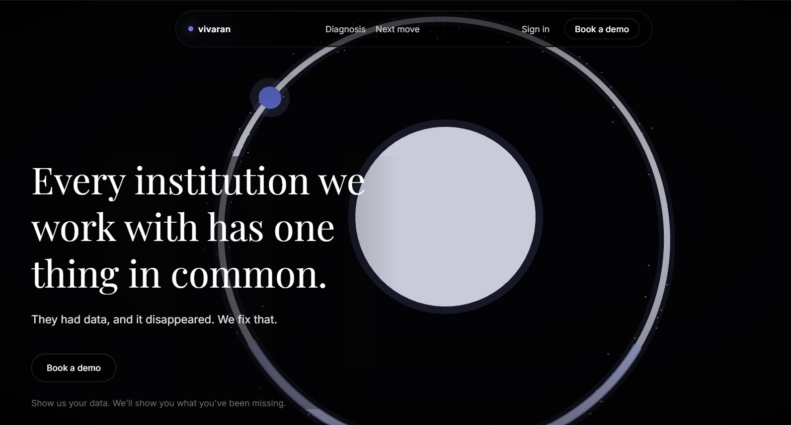

<h1 align="center">Vedant Sondur</h1>

  Building infrastructure for human observation.

  Founder of <strong>Vivaran</strong> &mdash; the data layer for institutions that develop people.

  
  &nbsp;
  

  

---

## Vivaran

Vivaran is observation infrastructure for institutions that develop people.

Schools, therapy centres, and clinics already run on human observation. Most of that context disappears into paper records, staff memory, and disconnected systems. Vivaran gives those observations a home: **Storage &rarr; Search &rarr; Patterns**.

The goal is simple: no observation dies with the person who made it.

---

## Why this matters

Institutions that work closely with people are rich in activity and poor in memory.

A teacher notices hesitation. A therapist sees first eye contact. A parent hears a new word. These moments matter, but most systems cannot preserve, connect, or explain them. I am building infrastructure that makes human observation legible, persistent, and compoundable.

---

## What I build around

- Observation capture and evidence systems
- Long-term memory architecture for institutions
- Multi-tenant SaaS across B2B and B2C workflows
- Neurodivergent-aware product design
- Systems that survive real use, not just demos

---

## Projects

- **[Vivaran](https://vivaran.app)** &mdash; observation infrastructure for institutions that develop people
- **[letta-teams](https://github.com/Vedant020000/letta-teams)** &mdash; orchestration for stateful agent teams
- **[letta-chrome-extension](https://github.com/Vedant020000/letta-chrome-extension)** &mdash; browser-to-memory bridge

---

  

